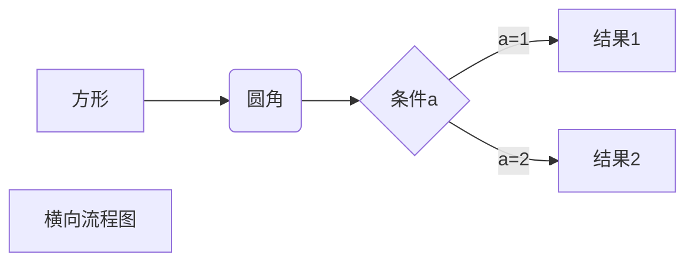
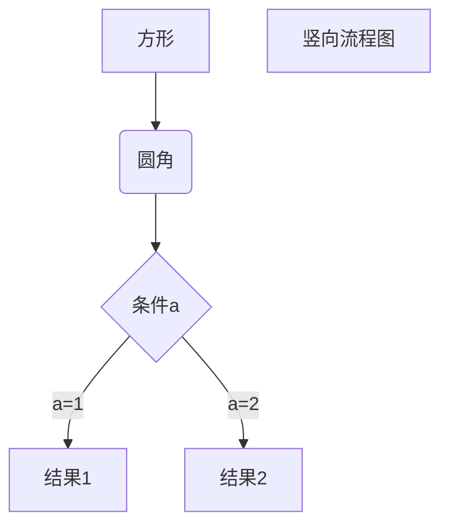
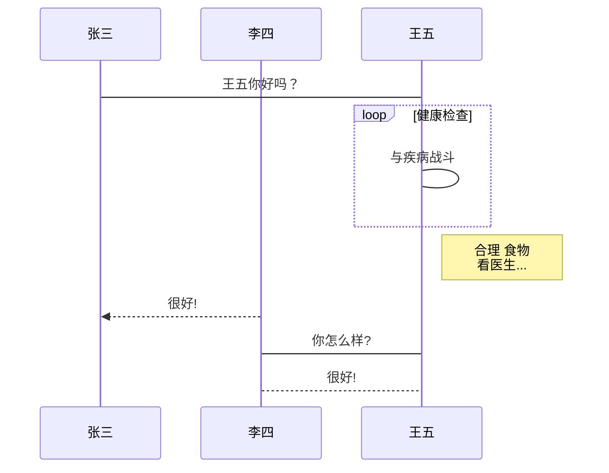

# Markdown 基本语法
## 什么是 Markdown

1.  Markdown 是一种轻量级标记语言，它允许人们使用易读易写的纯文本格式编写文档。
2.  Markdown 语言在 2004 由约翰·格鲁伯（英语：John Grubber）创建。
3.  Markdown 编写的文档可以导出 HTML 、Word、图像、PDF、Epub 等多种格式的文档。
4.  Markdown 编写的文档后缀为 `.md`, `.markdown`。

## Markdown 应用

1. Markdown 能被使用来撰写电子书，如：Gitbook。
2. 当前许多网站都广泛使用 Markdown 来撰写帮助文档或是用于论坛上发表消息。例如：GitHub、简书、reddit、Diaspora、Stack Exchange、OpenStreetMap 、SourceForge 等。

## 编辑器

1. 本教程主要使用 VSCode 编辑器和 typora 来讲解 Markdown 的语法，VSCode 支持 MacOS 、Windows、Linux 平台，且包含多种主题。
2. VS Code 默认集成了 Markdown 文档编辑插件，原生就支持高亮 Markdown 的语法。
3. VS Code（全称：Visual Studio Code）是一款由微软开发且跨平台的免费源代码编辑器。
4. VS code 官网地址：https://code.visualstudio.com/
5. typora 官网地址：https://typoraio.cn/
   VSCode 实时预览还需要执行 `Markdown: Open Preview to the Side` 命令来实现。
   在命令窗口输入`Markdown: Open Preview to the Side`命令：
   
   最终效果：
   
   如果你需要将 markdown 转为 PDF、图片、HTML 等格式也可以安装对应的插件来实现。

## Markdown 标题

Markdown 标题有两种格式。

1. 使用 = 和 - 标记一级和二级标题
   `= `和 `- `标记语法格式如下：

```markdown
一级标题
=================

二级标题
-----------------
```

使用效果如下图：

使用 # 号标记
使用` #` 号可表示 1-6 级标题，一级标题对应一个`#`号，二级标题对应两个`#`号，以此类推。

```markdown
# 一级标题
## 二级标题
### 三级标题
#### 四级标题
##### 五级标题
###### 六级标题
```

显示效果如下图：


## Markdown 段落格式

Markdown 段落没有特殊的格式，直接编写文字就好，段落的换行是使用两个以上空格加上回车。

当然也可以在段落后面使用一个空行来表示重新开始一个段落。


## 字体

Markdown 可以使用以下几种字体：

```markdown
*斜体文本*
_斜体文本_
**粗体文本**
__粗体文本__
***粗斜体文本***
___粗斜体文本___
```

显示效果如下图：


## 分隔线

你可以在一行中用三个以上的星号、减号、底线来建立一个分隔线，行内不能有其他东西。你也可以在星号或是减号中间插入空格。下面每种写法都可以建立分隔线：

```markdown
***

* * *

*****

- - -

----------
```

## 删除线

如果段落上的文字要添加删除线，只需要在文字的两端加上两个波浪线`~~`即可，实例如下：

```markdown
hello,world!
hello,world!
~~被删除的文字~~

```

## 下划线

下划线可以通过 HTML 的 `<u>`标签来实现：

```markdown
<u>带下划线文本</u>
```

## 脚注

脚注是对文本的补充说明。
以下实例演示了脚注的用法：

```markdown
[^要注明的文本]
```

Markdown 脚注的格式如下:

```markdown
[^要注明的文本]
[^要注明的文本]:测试内容
```

## Markdown 列表

Markdown 支持有序列表和无序列表。

无序列表使用星号(\*)、加号(+)或是减号(-)作为列表标记，这些标记后面要添加一个空格，然后再填写内容：

```markdown
* 第一项
* 第二项
* 第三项

+ 第一项
+ 第二项
+ 第三项

- 第一项
- 第二项
- 第三项
```

显示结果如下：
有序列表使用数字并加上`.`号来表示，如：

```markdown
1. 第一项
2. 第二项
3. 第三项
```

显示结果如下：

## 列表嵌套

列表嵌套只需在子列表中的选项前面添加两个或四个空格即可：

```markdown
1. 第一项：
    - 第一项嵌套的第一个元素
    - 第一项嵌套的第二个元素
2. 第二项：
    - 第二项嵌套的第一个元素
    - 第二项嵌套的第二个元素
```

显示结果如下：

## Markdown 区块

Markdown 区块引用是在段落开头使用 > 符号 ，然后后面紧跟一个空格符号：

```markdown
> 区块引用
> 区块引用
> 区块引用
```

显示结果如下：
另外区块是可以嵌套的，一个`>`符号是最外层，两个`>`符号是第一层嵌套，以此类推：

```markdown
> 最外层
> > 第一层嵌套
> > > 第二层嵌套
```

显示结果如下：

## 区块中使用列表

区块中使用列表实例如下：

```markdown
> 区块中使用列表
> 1. 第一项
> 2. 第二项
> + 第一项
> + 第二项
> + 第三项
```

显示结果如下：
列表中使用区块
如果要在列表项目内放进区块，那么就需要在 > 前添加四个空格的缩进。

列表中使用区块实例如下：

```markdown
* 第一项
    > 被包含内容
    > 被包含内容
* 第二项
```

显示结果如下：

## Markdown 代码

如果是段落上的一个函数或片段的代码可以用反引号把它包起来（`），例如：

```markdown
`printf()` 函数
```

显示结果如下：

## 代码区块

代码区块使用 4 个空格或者一个制表符（Tab 键）。
显示结果如下：
实例如下：
你也可以用 ` ``` `包裹一段代码，并指定一种语言（也可以不指定）：

````markdown
```javascript
$(document).ready(function () {
    alert('RUNOOB');
});```
````

显示结果如下：

## Markdown 链接

链接使用方法如下：

```markdown
[链接名称](链接地址)

或者

<链接地址>
```

例如：

```markdown
这是一个链接 [博客园](https://home.cnblogs.com/u/Dragonwelltea)
```

显示结果如下：
直接使用链接地址：

```markdown
https://home.cnblogs.com/u/Dragonwelltea
```

显示结果如下：

## 高级链接

我们可以通过变量来设置一个链接，变量赋值在文档末尾进行：

```markdown
这个链接用 1 作为网址变量 [Google][1]
这个链接用 runoob 作为网址变量 [Runoob][runoob]
然后在文档的结尾为变量赋值（网址）

  [1]: https://home.cnblogs.com/u/Dragonwelltea
  [博客园]:https://home.cnblogs.com/u/Dragonwelltea
```

显示结果如下：

## Markdown 图片

Markdown 图片语法格式如下：

```markdown


```

开头一个感叹号 !
接着一个方括号，里面放上图片的替代文字
接着一个普通括号，里面放上图片的网址，最后还可以用引号包住并加上选择性的 'title' 属性的文字。
使用实例：

```markdown


```

显示结果如下：
当然，你也可以像网址那样对图片网址使用变量:
显示结果如下：
Markdown 还没有办法指定图片的高度与宽度，如果你需要的话，你可以使用普通的  标签。
显示结果如下：

## Markdown 表格

Markdown 制作表格使用 `|`来分隔不同的单元格，使用 `-` 来分隔表头和其他行。
语法格式如下：

```markdown
|  表头   | 表头  |
|  ----  | ----  |
| 单元格  | 单元格 |
| 单元格  | 单元格 |
```

以上代码显示结果如下：
对齐方式

我们可以设置表格的对齐方式：

`-:` 设置内容和标题栏居右对齐。
`:- `设置内容和标题栏居左对齐。
`:-:` 设置内容和标题栏居中对齐。
实例如下：

```markdown
| 左对齐 | 右对齐 | 居中对齐 |
| :-----| ----: | :----: |
| 单元格 | 单元格 | 单元格 |
| 单元格 | 单元格 | 单元格 |
```

以上代码显示结果如下：

# Markdown 高级语法

支持的 HTML 元素
不在 Markdown 涵盖范围之内的标签，都可以直接在文档里面用 HTML 撰写。

目前支持的 HTML 元素有：`<kbd> <b> <i> <em> <sup> <sub> <br>`等 ，如：

```markdown
使用 <kbd>Ctrl</kbd>+<kbd>Alt</kbd>+<kbd>Del</kbd> 重启电脑
```

输出结果为：
转义
Markdown 使用了很多特殊符号来表示特定的意义，如果需要显示特定的符号则需要使用转义字符，Markdown 使用反斜杠转义特殊字符：

```markdown
**文本加粗**
\*\* 正常显示星号 \*\*
```

输出结果为：
Markdown 支持以下这些符号前面加上反斜杠来帮助插入普通的符号：

```markdown
\   反斜线
`   反引号
*   星号
_   下划线
{}  花括号
[]  方括号
()  小括号
#   井字号
+   加号
-   减号
.   英文句点
!   感叹号
```

公式
Markdown Preview Enhanced 使用 KaTeX 或者 MathJax 来渲染数学表达式。

KaTeX 拥有比 MathJax 更快的性能，但是它却少了很多 MathJax 拥有的特性。你可以查看 KaTeX supported functions/symbols 来了解 KaTeX 支持那些符号和函数。

默认下的分隔符：

- `$...$ 或者 \(...\) `中的数学表达式将会在行内显示。
- ` $$...$$ 或者 \[...\] 或者 ```math ` 中的数学表达式将会在块内显示。
  输出结果为：

```markdown
\   反斜线
`   反引号
*   星号
_   下划线
{}  花括号
[]  方括号
()  小括号
#   井字号
+   加号
-   减号
.   英文句点
!   感叹号
```

## 流程图

- typora 可以解析所有，其余博客平台只可解析前两种

1. 横向流程图源码格式：
   
   显示结果如下：



2. 竖向流程图源码格式：
   
   显示结果如下：



3. 标准流程图源码格式：

```flow
st=>start: 开始框
op=>operation: 处理框
cond=>condition: 判断框(是或否?)
sub1=>subroutine: 子流程
io=>inputoutput: 输入输出框
e=>end: 结束框
st->op->cond
cond(yes)->io->e
cond(no)->sub1(right)->op
```

显示结果如下：
 4. 标准流程图源码格式（横向)：

```flow
st=>start: 开始框
op=>operation: 处理框
cond=>condition: 判断框(是或否?)
sub1=>subroutine: 子流程
io=>inputoutput: 输入输出框
e=>end: 结束框
st(right)->op(right)->cond
cond(yes)->io(bottom)->e
cond(no)->sub1(right)->op
```

显示结果如下：
 5. UML 时序图源码样例：

```sequence
对象A->对象B: 对象B你好吗?（请求）
Note right of 对象B: 对象B的描述
Note left of 对象A: 对象A的描述(提示)
对象B-->对象A: 我很好(响应)
对象A->对象B: 你真的好吗？
```

显示结果如下：
 6. UML 时序图源码复杂样例：

```sequence
Title: 标题：复杂使用
对象A->对象B: 对象B你好吗?（请求）
Note right of 对象B: 对象B的描述
Note left of 对象A: 对象A的描述(提示)
对象B-->对象A: 我很好(响应)
对象B->小三: 你好吗
小三-->>对象A: 对象B找我了
对象A->对象B: 你真的好吗？
Note over 小三,对象B: 我们是朋友
participant C
Note right of C: 没人陪我玩
```

显示结果如下：
 7. UML 标准时序图样例：



显示结果如下：
 8. 甘特图样例：

